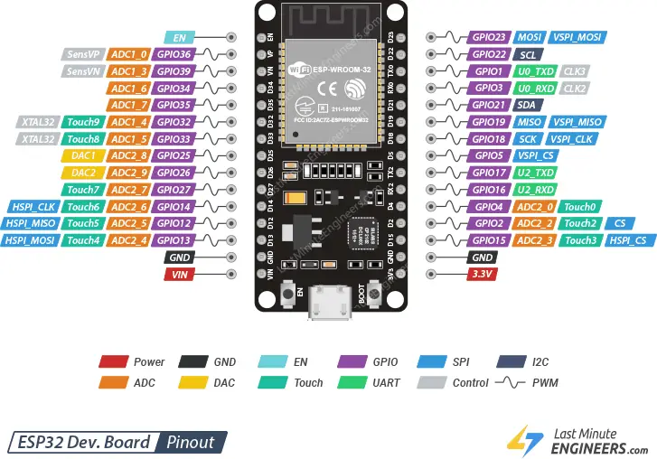

# ESP Wroom 32

## Pinout
ESP Wroom 32 Board



- 내장 LED는 GPIO-2

## Arduino Setup


## Test Code (Blink)

```cpp title="esp32-blink.ino" linenums="1"
#define LED_PIN 2
void setup() {
    pinMode(LED_PIN, OUTPUT);
}

void loop() {
    digitalWrite(LED_PIN, HIGH);
    delay(300);
    digitalWrite(LED_PIN, LOW);
    delay(300);
}
```